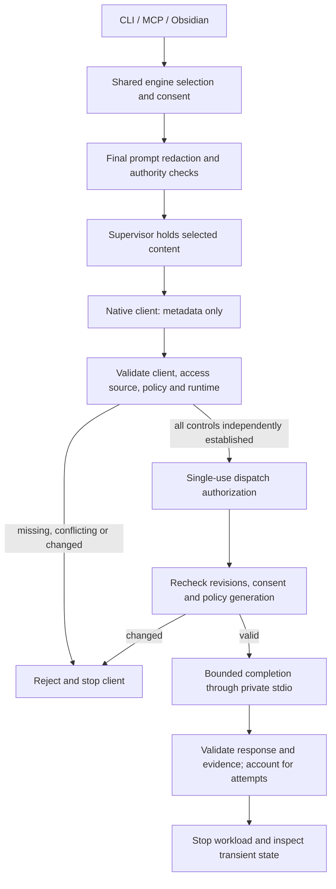

# NW0-C4 Claude supervisor design and rejection prototype

- Result: **the zero-inference rejection prototype works; native completion remains disabled**.
- Baseline: `d188333`, branch `docs/ob1-native-workspace-plan`, macOS arm64.
- Scope: one 45-minute NW0-C cap, synthetic fixtures, zero model calls. No real accounts,
  credentials, notes, or managed settings were inspected or changed.
- Implementation: disposable private Python prototype and tests. No product runtime code,
  dependency, packaging, or public command was added.

Claude subscription remains required with OpenAI API, Anthropic API, and Gemini API. Codex remains
deferred. This document records the supervisor design, executed rejection behavior, and the exact
mechanisms still needed before any native completion can receive note content.

## Supervisor boundary

The app composition layer owns one supervisor per selected inference attempt. The engine owns
consent, accepted revisions, exclusions, policy generation, and request/usage reservations. The
Obsidian plugin and CLI use the same engine operations; neither supplies a policy attestation or
talks directly to an official client. The supervisor is a transport boundary, not a second scheduler
or orchestration runtime.

The rejection branch is exercised with the official client in C4. Native dispatch authorization,
completion, and active-workload cleanup are design requirements, not implemented or passed branches.
The positive path exists only in a fake transport with no Claude writer or network implementation.

### Existing contracts reused

| Existing code | Responsibility in this design |
|---|---|
| `core/ports.py::StagedExecutionRequest` and `StagedAssetExecutor` | Carry selected text, explicit readable assets/network hosts, deadline, and output bound. The prototype permits inline synthetic text only; it does not implement asset staging. |
| `core/policy.py::invoke_staged_executor` | Enforce cloud authority, external-egress authority, and permitted-host inclusion before invoking the executor. The existing port does not implement OS confinement. |
| `capture/redaction.py::has_redaction_finding` | Apply the same detector used by the existing cloud provider service before native-client launch. No replacement redaction policy is introduced. |
| `PrivacyDecision` / `Authority` | Preserve the caller's effective authority. A login or metadata result cannot create consent or broaden an existing decision. |
| Existing agent-config abort/close and permission patterns | Inform bounded teardown and denial handling. No SDK/runtime import or OAuth-token relay is taken from that implementation. |

The current staged-executor boundary maps executor exceptions to `implementation_failure`.
C4 retains fixed diagnostic reason codes in private receipts but does not add public error enums.
NW1/NW2 must select a bounded public error projection through the common operation contract rather
than exposing raw client diagnostics or changing the engine's dependency direction.

## States and release rules

| State | Allowed behavior | Exit condition |
|---|---|---|
| Closed | Hold content in coordinator memory; check current engine eligibility, redaction, authority and limits. No client launch for denied input. | Eligible request enters metadata preflight; otherwise return a bounded error. |
| Metadata only | Start a pinned official binary in a constrained runtime. Send only allowlisted control messages. Content is absent from argv, environment, runtime fixtures, and client stdin. | Validate observations and independently obtained runtime/policy evidence, or reject. |
| Prepared | A supervisor-owned, single-use authorization binds request digest, accepted revisions, provider/access mode, model, client instance/version, policy identity/generation, and expiration. | Recheck the current engine generation and runtime policy immediately before release. |
| In flight | Send selected content once; reserve/count every actual attempt, bound bytes/time, reject tools and unexpected control messages, and observe policy changes. | Validated result or cancellation/failure; no automatic model/provider/access fallback. |
| Stopped | Close pipes, terminate the owned workload, invalidate authorizations, reject late output, and inspect approved writable locations. | Return bounded result/error; never resume an abandoned request implicitly. |

The fake prototype implements a narrower permit binding: request fields, snapshot digest, PID,
binary hash, engine-generation value, expiration, and object identity. It demonstrates observed
revocation, request/policy changes, stale snapshots, and replay rejection. It has no durable engine
revision transaction, actual subscription identity, or native runtime attestation. Its one-second
snapshot age is a test constant, not a product setting or evidence that remote policy is fresh.

An authorization must come from the supervisor's trusted control path. Client JSON, plugin input,
note text, and caller-supplied booleans cannot certify confinement or policy completeness. A fake
test witness cannot be used by the native transport. C4's native executor has no completion-writing
method, and always remains closed while the required native evidence is unavailable.

### Policy observation and rejection

C4 reads settings from the same pinned native Claude Code `2.1.265` process it supervises. It does
not use C3's older SDK resolver to certify that process. The installed binary hash is checked before
launch. This removes the SDK-version mismatch for observed native settings; it is not race-free
executable attestation or proof that the settings response covers every policy source.

The prototype rejects these cases with fixed reason codes:

1. Missing or unverified subscription source, an API-key source, another provider, or conflicting
   login/model settings. `firstParty` alone is insufficient; no successful real subscription-source
   value has yet been verified and allowlisted.
2. Hooks, environment routing/retry overrides, unresolved policy helpers, unknown policy keys or
   sources, unsafe permission settings, or absent required controls. It checks individual sources
   as well as effective settings, so a suspicious source cannot disappear behind a friendly summary.
3. Missing policy completeness, complete tool catalog, or runtime/authentication evidence. Empty
   MCP/context diagnostics and an empty source list do not establish those properties.
4. Changed client identity, request, policy generation or settings; expired/future snapshots; reused
   or forged fake permits. Observed revocation prevents the fake sink from receiving content.
5. Oversized, malformed, duplicate-key, deeply nested, unexpected, or mismatched metadata messages.
   Client diagnostics/errors do not become user-visible raw text.

The metadata reader imposes a 20-second process cap and a 64 KiB combined-output ceiling. Native
completion retains the existing 16 KiB selected-input/accepted-output and 60-second attempt limits;
those real-inference controls are not passed by metadata tests. The prototype validates request
bounds and decoder limits, but does not claim a completed native flooding or active cancellation test.

Managed policy may change while a session runs, and parent settings have limited precedence.
The official [managed-settings contract](https://code.claude.com/docs/en/managed-settings) describes
those behaviors. A second settings read and a short lease alone do not eliminate the interval
between checking policy and sending content. C4 tests a change observed during preflight; it does
not detect every external change. Production needs supported policy identity/change semantics plus
independent containment. If that combination cannot establish the boundary, native release stays
disabled. Do not strip managed policy or treat an unreadable source as absent.

## Authentication and runtime design

The official runtime may access its own authentication store. The model receives only selected,
policy-checked content and no filesystem/network/subagent tools. The supervisor neither reads token
values nor supplies OAuth-token environment variables. Login/status is a separate no-note operation.
Credential source must be verified again on the process that would receive content.

| Runtime asset | Required treatment |
|---|---|
| Selected note text | Keep in engine/supervisor memory until release; use private stdio. No argv, environment, or persistent prompt file. |
| Official client and support files | Version/hash-bound runtime inputs. Native proof must address replacement between verification and execution. |
| Official authentication/bootstrap files and Keychain access | Preserve the user's selected official login. Grant the client only the demonstrated paths/services and rotation operations it requires; the supervisor does not read or copy secrets. |
| Organizational policy | Preserve applicable policy and reject incompatible/indeterminate results. Helpers and updates need observable outcomes under the same constraints; blocking a required helper must reject the run. |
| Transient state | App-owned private runtime/temp directory; bound writes and inspect transcripts, diagnostics, caches, backups, and session-discovery records on every exit path. Credentials are not transient prompt artifacts. |
| Network and descendants | Enforce reviewed provider/auth egress and ownership of the complete workload independently of model/tool flags. Do not equate a process-group kill with verified detached-descendant cleanup. |

The authentication layout is the next unresolved implementation boundary. A disposable
`CLAUDE_CONFIG_DIR` selects another credential store, including another macOS Keychain entry, as
documented in [credential management](https://code.claude.com/docs/en/authentication#credential-management).
It cannot silently replace the agreed existing-login reuse behavior.

| Approach | Assessment |
|---|---|
| Official completion interface with policy/capability/auth identity and transient-state separation | Best architecture. Supported availability remains unproven; keep it as the preferred upstream-supported option. |
| Supervised native client preserving its existing auth namespace | Recommended next containment experiment. Enumerate minimal auth/bootstrap reads and token-rotation writes, isolate other runtime state, observe effective policy, and enforce filesystem/process/egress rules. Feasibility is pending on both platforms. Broad home-directory access is not the fallback. |
| Separate official-client login in a dedicated namespace | Avoids mixing runtime state, but requires another login and does not satisfy existing-login reuse by itself. Not selected as a launch shortcut. |

No token-copy broker, client fork, hidden credential-store override, required container/VM, or new
shipping dependency is selected. The Mac sandbox used in these experiments denies real credentials
and policy, so it cannot establish the recommended authenticated layout.

## Executed evidence and limits

The private prototype contains `supervisor.py`, `test_supervisor.py`, and
`native_rejection_probe.py`. Its contract suite passed **61 tests**. Five existing project tests in
`tests/security/test_staged_executor.py` also passed. Coverage includes shared authority/host checks,
excluded/redacted/oversized input preventing metadata access, policy/access conflicts, malformed
metadata, and fake positive/revocation/replay behavior. These are not 66 subscription integration tests.

Six native metadata processes were retained during implementation: two first exercised rejection
after shutdown, two moved the decision before shutdown, and two verified the final parser/integration.
Only the last four establish live rejection. All used synthetic fixtures, network denial, no real
credentials, and no user/model turns. The final pair used the same pinned native binary and explicit
`claude-sonnet-5` selection; no response-model attribution or model availability was tested.

| Final integration case | Rejection before termination | Content outcome |
|---|---|---|
| Stable metadata | Missing subscription auth, unverified complete policy/catalog, and unverified runtime/auth boundary. Client was still alive when rejected. | Zero note bytes to native stdin, argv, or inspected runtime files; zero model calls. |
| Routing changed between settings reads | Added `policy_changed_during_preflight` and `policy_environment_present` to the same unresolved controls. Client was still alive when rejected. | Zero note bytes to native stdin, argv, or inspected runtime files; zero model calls. |

Private receipts retain each elapsed time, byte count, PID, request/response, sandbox fixture, binary
hash, and decision ordering. All six processes completed within the 20-second metadata cap and
64 KiB output ceiling and were waited for after termination. The initial post-stop implementation
is retained as development evidence, not counted as proof of a live gate.

The fake positive case delivered eligible synthetic text once to an in-memory sink through the
existing engine boundary. Its test-only identity and simulated missing witnesses are intentionally
not accepted by the native path. No model API, token resolver, official authentication call, or
native completion was used to make that positive case pass.

## Next bounded experiment

Prove the recommended native runtime layout using synthetic authentication/bootstrap and policy
fixtures on this Mac. Cap the follow-up at 45 minutes from remaining NW0-C, with zero model calls.
Exercise permitted auth-file operations, denied unrelated reads/writes, required-policy failures,
policy changes, and owned-workload termination. Define how the same layout preserves the real
official login before an authenticated no-note check; do not inspect or copy live credential values.

Pass requires concrete OS enforcement and clear rejection for every unsupported auth/policy state.
Missing primitives produce a documented architecture result, not an implicit exemption or another
unbounded flag search. Linux implementation/evidence, authenticated policy freshness, complete tool
catalog, egress/attempt accounting, and active retention/cancellation remain launch gates.
Preserve prior C1–C4 effort and the four-path attempt limits. NW1 remains behind the reviewed NW0 record.
