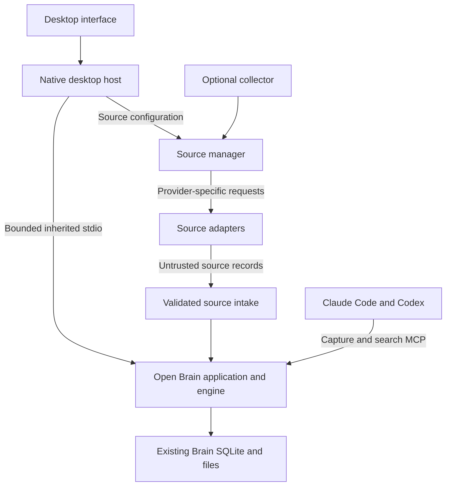

# Desktop companion and source capture

Status: D0 and D1 complete locally on macOS arm64; D2 through D4 remain proposed.

Date: 2026-09-14

Grounded against commit: `33df3d79268c47525e2aefd597ecbd66ea831726`.

D0's boundaries are recorded in [ADR 0017](../architecture/decisions/0017-desktop-companion-boundary.md)
and the updated [product contract](../product-family.md). Its native acceptance is recorded in the
[D0 evidence report](../audits/2026-09-14-desktop-d0.md). D1 acceptance is recorded in the
[D1 audit](../audits/2026-09-14-desktop-d1-audit.md). D2 through D4 propose new behavior; this plan does
not authorize enabling background collection on a user's computer.

## Outcome

A person installs Open Brain Desktop, opens Sources, connects an account, chooses what to capture,
previews the selected records, and enables collection. They can connect Claude Code or Codex to the
same Brain and retrieve a saved fact in a fresh session. Obsidian is optional.

The desktop app has five destinations: Search, Capture, Sources, Activity, and Settings. Sources uses
the same four-step flow for each adapter: choose, connect, select, preview. Activity shows actual
last-success time, added/updated/skipped counts, and an actionable failure when a source needs
attention. A successful sign-in alone never means a source is syncing.

The first useful release covers local capture/search, GitHub issues and pull requests, and explicit
memory saves from Claude Code and Codex. All requested sources remain in the roadmap below; they
must not appear as working integrations before their end-to-end checks pass.

## Decisions and assumptions

| Question | Direction | Status |
|---|---|---|
| Product surface | Dedicated desktop companion, independent of Obsidian | Selected by owner |
| Desktop shell | Tauri 2 with React and TypeScript; native Rust command boundary | Selected; D0 native proof passed on macOS arm64 |
| Core | Reuse the current Python engine and versioned stdio client protocol | Grounded in existing implementation |
| Background collection | Separate optional local collector with explicit enable, pause, and stop controls | Proposed; no service installation authorized by this document |
| Platform sequence | Prove macOS arm64 first; preserve Linux x86_64 as a separate release gate | Proposed delivery order, not a Linux support claim |

Tauri supports packaged external executables, including PyInstaller applications, and bounded
window capabilities. Those are useful foundations, not evidence that Open Brain's bridge, packaging,
or process cleanup already works inside Tauri. See [sidecars][tauri-sidecar] and
[capabilities][tauri-capabilities].

Alternatives considered:

| Option | Benefit | Cost and reason for recommendation |
|---|---|---|
| Tauri 2 | Native host with a web interface and explicit native commands | Adds Rust and platform-webview testing; recommended for a small local companion |
| Electron | Reuses Node process APIs and provides a consistent Chromium renderer | Larger bundled runtime; valid fallback if Tauri's native proof fails |
| SwiftUI plus a separate Linux interface | Best platform-specific integration and accessibility potential | Two interface implementations; choose if native polish outweighs shared UI work |

Electron would require a sandboxed renderer, context isolation, and a narrow preload interface;
existing Node bridge code cannot simply run in a renderer. See [Electron's security guidance][electron-security].

## Existing implementation to reuse

| Existing surface | Reuse and limitation |
|---|---|
| [Plugin bridge](../../packages/app/src/open_brain/services/plugin_bridge.py) | `open-brain-client` v1 handshake, capture, search, workspace, and graph operations. It is an owner-facing interface, not a connector authority boundary. |
| [Obsidian bridge](../../packages/obsidian-plugin/src/bridge.ts) | Framing, deadlines, environment filtering, and child cleanup behavior. Its Node-specific process implementation cannot run directly in Tauri's webview. |
| [Client contracts](../../packages/obsidian-plugin/src/contracts.ts) | Request/response shapes and bounded status vocabulary. Share pure contracts when a second consumer exists; retain Obsidian compatibility. |
| [Optional connector package](../../packages/connectors/pyproject.toml) | Provisional YouTube/conformance code. Audit imports and runtime completeness before reuse; it is not a ready catalog of SaaS adapters. |
| [Markdown import contract](../import.md) | Stable identity, immutable revisions, crash recovery, active-revision search, and export semantics to preserve for new sources. |

The bridge has a 2,000-request session bound. A desktop session must handle its exhaustion explicitly.
Retrying a capture after a lost response must preserve its operation ID; a new ID can create a
duplicate. Reconnection must not silently restore provider consent or replay owner mutations.

Existing engine startup recovery can revoke provider consent and invalidate pending inference.
[INTEGRATION-029](../engineering/gotchas/README.md#integration-029-provider-consent-and-suggestion-review-need-one-plugin-owned-engine-lifetime)
requires one engine session across provider setup, refresh, review, and acceptance. Test simultaneous
desktop, Obsidian, CLI, MCP, and collector use before introducing another engine opener. Do not
assume SQLite WAL alone resolves these application-level interactions.

## Component boundaries

Proposed code locations are `packages/desktop` for the interface/native host and
`packages/collector` for source orchestration, scheduling, and credential references. Their package
names, build systems, and entry points must stay outside the default Python application dependency
closure. Connector adapters belong in the optional connector distribution after its readiness audit.

The renderer has no database handle, general shell API, arbitrary executable selector, or raw
credential retrieval operation. The native host validates named operations and manages child
lifetimes. It loads packaged interface assets; imported content is rendered as inert text or safely
sanitized markup. Opening an original source validates the URL scheme.

The core retains its foreground CLI/MCP behavior and opens no network listener. Persistent scheduling,
source authentication, source network access, and optional per-user service registration belong to
the companion/collector product boundary. No archived Secure Node module is restored.

Use explicit IPC between the desktop and a separately running collector. On the supported platforms,
prove a private Unix-domain socket and single-instance ownership, or select another documented local
transport at D0. It is collector control IPC, not a core HTTP server or a source-content search API.
Filesystem permissions protect it from other OS users; make no hostile-same-user isolation claim.

## Connection and capture contract

Each source declares its account/instance type, authentication method, permissions, selectable
resources, supported content types, change cursor, and connection test. The catalog may share UI
fields, but providers retain their own authentication and pagination rules.

Store non-secret configuration and checkpoints separately from Brain content. Keep credentials in
the OS credential store; if unavailable, offer session-only operation and disable unattended sync.
Do not write tokens into the renderer, agent configuration, exports, logs, command arguments, or
source records. Request the least provider permission that supports the selected behavior, and show
when an API token grants broader access than Open Brain's import filters.

Prefer direct supported native-client authentication. GitHub's documented device flow is a first
candidate, subject to an actual registered-app proof. Never embed a confidential OAuth client secret
in the desktop bundle. Providers requiring confidential-client exchange need a separately designed
backend or a user-supplied deployment; do not silently add a hosted relay. A temporary loopback OAuth
callback, if needed, is a companion-only capability with a fixed purpose, state/PKCE validation, and
cleanup after completion. See [GitHub device flow][github-device].

The source intake validates account ID, resource ID, external item ID, revision or content digest,
source URL, source timestamps, and content before calling engine capture. Source data remains
unverified. A connector cannot assert owner-authored trust or invoke graph acceptance, consent
changes, or other owner operations. The current owner `capture.create` operation must not be used
as an unrestricted sink for third-party adapters.

Use a durable delivery key derived from connection identity, external item identity, and revision.
Checkpoint only after durable ingestion acknowledgement. Recovery replays an existing bounded batch
with the same delivery keys. Persist partial failures and retry with backoff; one unavailable source
must not block other sources. Bound downloaded bytes, attachments, queue size, retries, and disk use.

Specify source deletion, lost access, and filter narrowing separately. Stop new imports immediately
after pause/revocation is acknowledged, recheck authorization before committing in-flight records,
and mark confirmed removed revisions inactive in live search. An incomplete scan or an API failure
is not evidence that every unseen item was deleted. Historical revisions remain in Portable Brain
under the current retention contract. Disconnecting a source does not delete its imported history.
Selective removal/purge requires a separate engine design; do not promise it through a UI button.

Preview fetches a bounded sample after sign-in, before durable Brain capture. Exclude pending previews
and temporary downloads from export and clean them up on cancellation. Show actual selected sources,
history range, content examples, and where records will become searchable before Enable capture.

Capture permission and AI-client read permission are separate. Current MCP search is whole-Brain.
Until source-level read enforcement exists, explain that scope in agent setup and omit misleading
per-source privacy switches. If source restrictions are added, enforce them on retrieval, snippets,
graph context, and every client surface; changing frontend filters alone is insufficient.

## Collection lifecycle

Automatic collection is a proposed opt-in mode. Scheduling and launch-at-login are separate choices.
Default onboarding performs a bounded manual import until the user enables automatic collection.

| Action or state | Required behavior |
|---|---|
| Close the desktop window | Show whether collection continues; an enabled collector does not depend on the window. |
| Quit desktop | Stop its owned Brain child. If independent collection is enabled, label that it continues and offer a separate stop-all action. |
| Pause or stop collection | Stop fetching, cancel or drain the bounded in-flight work under the documented acknowledgement rule, and persist the paused state. |
| Sleep, logout, or reboot | No laptop-local collection during sleep or logout. Resume from a durable cursor after wake; start after login only if enabled. |
| Disable or uninstall collector | Remove only owned scheduling/service registration; preserve Brain data and retained history. |

The collector must have one durable lease per connection so desktop Sync now and scheduled runs do
not race each other. Reports must distinguish last successful sync from last attempted sync. A
locked OS credential store produces Needs sign-in/unlock, not an endless rapid retry loop.

## Ordered milestones

### D0: prove the desktop and distribution boundaries

Completed locally on 2026-09-14. See the [native and recovery evidence](../audits/2026-09-14-desktop-d0.md).
Linux clean-host acceptance and public desktop distribution remain separate release gates.

Write an ADR that scopes the current foreground-only guarantees to the core distribution and defines
the separate companion/collector permissions. Reconcile the product, configuration, architecture,
and install documentation with that ADR. Leave historical acceptance records intact.

Build a small Tauri native proof against a synthetic Brain: launch an exact known executable,
handshake, capture, search, and terminate its process group. Exercise deadline, malformed response,
session exhaustion, lost response, and version mismatch. Test the multi-client recovery scenario
described above; if opening another engine invalidates another client's active state, resolve that
architecture before enabling concurrent collection. Preserve consent revocation on actual crash
recovery.

Compare using the installed Homebrew runtime with bundling an exact paired runtime. Prefer a
separately versioned desktop bundle containing matched core/Graphify artifacts, subject to native
audit and Homebrew distribution proof. Pin component digests and protocol compatibility. Reject an
older runtime opening a newer unsupported schema. Do not replace an existing user's installed CLI
as a side effect of desktop startup.

Gate: native evidence on macOS arm64, a defined Linux x86_64 packaging path, no core listener or
service dependency, and an explicit decision on multi-client recovery. Tauri's Linux WebKitGTK
requirements need a clean-host check; documentation support is not an install proof.

### D1: deliver local desktop use and agent memory

Keep the desktop optional. Expose the same agent-setup operations through a headless CLI.
Implement the five destinations and the real local capture/search path. Reuse the existing Brain
location automatically. Empty states explain the next action. A missing/incompatible runtime or
unsupported platform gets an actionable state, not a fabricated connected indicator.

Add Claude Code and Codex setup that separately selects capture and search capabilities, names the
target Brain, and lets the user choose project or user scope. Use supported client configuration
interfaces. Preview and preserve existing configuration/instructions, write only owned entries, and
make removal restore owned changes without overwriting later user edits. Point agent MCP at the same
runtime/data location as the desktop; never create a second silent Brain.

Add concise standing memory instructions and a save/search test. Full transcript capture and
automatic summarization are separate opt-ins implemented in D4. Agent setup never collects another
application's login credentials.

Gate: a fresh desktop capture is found through both supported MCP clients; a fact explicitly saved by
each client is available in a fresh client session; repeated setup is idempotent; removing integration
preserves unrelated settings. Demonstrate real native UI operation, not just a browser simulation.

### D2: make GitHub the first complete source

Implement the source registry, validated third-party intake, connection configuration, preview,
checkpoints, and GitHub issues/pull-request adapter. Include comments and stable source links; defer
repository file mirroring and attachment ingestion until separately specified.

Prove public application registration and the selected authentication flow with a disposable account
and repository. An owner-created token can test transport, but is not proof of the promised public
one-click sign-in experience. Never make end users register developer applications as the default
onboarding path.

Choose schema changes against the actual engine contracts. If source provenance requires a portable
format change, version and verify it; do not insert arbitrary fields into existing canonical records
or claim unchanged Portable Brain v1 compatibility without tests.

Gate: connect, choose one repository, preview, import, search, edit an upstream item, and sync again.
Replaying the same revision creates no duplicate; the changed revision replaces the live result;
export preserves required history/provenance. Exercise revocation, permission loss, 429/backoff,
pagination interruption, and crash after capture but before checkpoint.

### D3: add optional unattended collection

Package the collector separately and expose its state in desktop Settings and Activity. Implement
explicit enable/disable, per-source schedules, pause, login behavior, single-instance ownership, and
desktop-to-collector control. Per-user OS supervision is permitted only in the new optional product
boundary established by D0. The base package and base install smoke must remain foreground-only.

Gate: with a synthetic source, close the window and observe an imported revision; pause and observe no
subsequent import; resume without duplicates; sleep/wake and restart from the saved cursor. Verify
collector cleanup, owned-service removal, locked credentials, disk-full behavior, and coexistence
with desktop, Obsidian, CLI, and MCP on each supported platform.

### D4: add the remaining sources behind their own gates

| Source | First supported scope | Release gate |
|---|---|---|
| GitLab and Jira | Selected projects, issues, discussions/comments, merge requests where applicable | Cloud/instance identity, pagination, changed records, and the supported auth topology |
| Email and Google Drive | Gmail/Microsoft 365 selected labels/folders; individually selected Drive files | Provider verification requirements, body extraction, OAuth-scope disclosure, and attachment exclusions |
| Slack | Selected accessible channels and thread context | Workspace approval, rate-limit-aware history import, retention/access changes, and token revocation |
| Claude Code and Codex session capture | Explicitly selected local projects, with summaries/transcripts separately chosen | Versioned supported events or a tested transcript adapter; bounded queues, secret exclusions, opt-out, and no feedback loop from Brain results into new captures |
| iMessage | Selected conversations on a supported Mac | Documented permission experience, repeatable access/format proof, edits/deletions, attachments policy, and graceful OS-version incompatibility |

Finish one adapter's authentication-to-export journey before marking it supported. Do not infer
Codex event support from Claude hooks or treat iMessage as a cloud OAuth connector. Provider account
approval and real desktop acceptance may block a source release without blocking completed sources.

## Verification and completion evidence

For changes to the existing Python/Obsidian code, run the repository's `make verify`. Native or
packaging changes also require `make native-audit` and `make homebrew-smoke`. Run `git diff --check`
and `actionlint .github/workflows/ci.yml` before implementation handoff. When dependency metadata
changes, regenerate its lock and check lock consistency before frozen verification.

Add desktop-native compilation, frontend typecheck/component tests, bridge contract tests, collector
integration tests, and exact-artifact UI smoke targets when those packages exist. Define the actual
commands in their package instructions and CI; these are future checks, not existing passing targets.

Use synthetic fixtures only. Record native OS/architecture, artifact digests, test commands/results,
process lifetimes, connection/import receipts, and export verification. Public release must show a
new-user journey on every claimed platform. A clickable concept, mocked sign-in, successful compiler,
or unattended process launch alone does not establish that journey.

Implementation is tracked by milestone. D0 and D1 have passing local native evidence. D1 includes
shared headless setup and actual Claude Code/Codex save and fresh-session recall with the desktop
closed. Source connections and independent collection remain D2 through D4. Public desktop
distribution and Linux clean-host acceptance remain separate gates.

## References

[tauri-sidecar]: https://v2.tauri.app/develop/sidecar/
[tauri-capabilities]: https://v2.tauri.app/security/capabilities/
[electron-security]: https://www.electronjs.org/docs/latest/tutorial/security
[github-device]: https://docs.github.com/en/apps/oauth-apps/building-oauth-apps/authorizing-oauth-apps#device-flow

- [Tauri platform prerequisites](https://v2.tauri.app/start/prerequisites/)
- [Codex MCP setup](https://developers.openai.com/codex/mcp/)
- [Claude Code hooks](https://code.claude.com/docs/en/hooks)
- [Google restricted-scope verification](https://developers.google.com/identity/protocols/oauth2/production-readiness/restricted-scope-verification)
- [Google Drive scope choices](https://developers.google.com/workspace/drive/api/guides/api-specific-auth)
- [Slack rate limits](https://docs.slack.dev/apis/web-api/rate-limits/)

Provider/framework references were inspected during the 2026-09-14 design discussion. Recheck them at
adapter implementation time; they establish available mechanisms, not completed Open Brain support.
